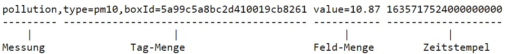

Nun werden Daten in die Datenbank eingefügt.

`influx write --format=lp -f dataset_lineProtocol.txt`{{execute}}

Sie befinden sich im _Line Protocol_-Format von InfluxDB in der Datei `dataset_lineProtocol.txt`.
Es handelt sich um 17.721 Messwerte.

Der Aufbau eines Dateneintrags ist in Abbildung 2 gezeigt:

_Abbildung 2: Aufbau der Daten im Line Protocol, nach [X]_

[//]: # "X in Quellen ersetzen"

Wichtig in diesem Datenformat sind die Leerzeichen nach der Tag-Menge und der Feld-Menge.

Die Daten stellen Messwerte eines Feinstaubmessgeräts vom 1.10.2021 bis 1.11.2021 in Stuttgart dar.
Sie stammen von der openSenseMap [8]. 
Der `type` ist dabei der Typ des Feinstaubsensors, der Teilchen kleiner als 10µm Durchmesser erfasst [8]. 
Die `boxId` ist die Identifikationsnummer der Messbox. 
Die `value` stellt den gemessenen Wert in µg/m³ dar. 
Die letzte Nummer ist der Zeitstempel im RFC3339 Format [3].

Alternativ können auch CSV-Dateien oder Daten aus Quellen per Telegraf eingefügt werden.
